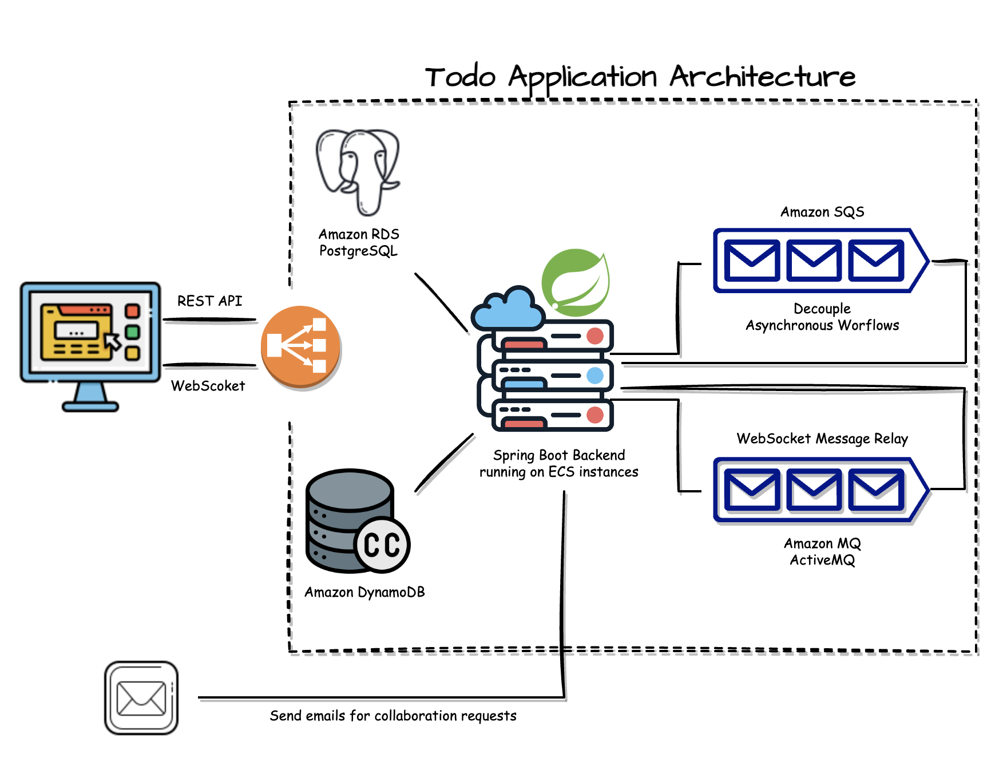

# AWS Todo Application

## Description
Developed Todo application where users can create todos and collaborate with other users by sharing
todos with each other. 


## Application Features
- **Registration and Login:** Spring security is used in conjunction with Amazon Cognito
to achieve user authentication and authorization.
- **CRUD Operations**: Users are able to create, view, and delete todos.
- **Share todos and Email Notifications:** Users are able to share todos with other application users through email
notifications that are sent via Amazon Simple Email Service (SES) and Amazon Simple Queue Service (SQS).
- **Push Notifications:** Todo owners get notified in the browser in real time when a collaboration request for a particular todo was 
accepted by the invited user. This is achieved using WebSockets and a managed Apache ActiveMQ message broker running
on Amazon MQ.

## Technologies
- Java
- Spring Boot
- Spring Data JPA
- Spring Security
- PostgreSQL
- Amazon Web Services
- AWS CDK, SES, Cognito, RDS, SQS, ECS, and ECR

## Architecture

### Application Architecture


### Network Architecture


## Local Project Setup

### Mandatory Requirements
* Java 17
```
❯ java --version
openjdk 17.0.5 2022-10-18
OpenJDK Runtime Environment Temurin-17.0.5+8 (build 17.0.5+8)
OpenJDK 64-Bit Server VM Temurin-17.0.5+8 (build 17.0.5+8, mixed mode)
```
* Docker Engine and Docker Compose
```
❯ docker version
Client:
 Cloud integration: v1.0.29
 Version:           20.10.21
 API version:       1.41
 Go version:        go1.18.7
 Git commit:        baeda1f
 Built:             Tue Oct 25 18:01:18 2022
 OS/Arch:           darwin/arm64
 Context:           default
 Experimental:      true

Server: Docker Desktop 4.15.0 (93002)
 Engine:
  Version:          20.10.21
  API version:      1.41 (minimum version 1.12)
  Go version:       go1.18.7
  Git commit:       3056208
  Built:            Tue Oct 25 17:59:41 2022
  OS/Arch:          linux/arm64
  Experimental:     false
 containerd:
  Version:          1.6.10
  GitCommit:        770bd0108c32f3fb5c73ae1264f7e503fe7b2661
 runc:
  Version:          1.1.4
  GitCommit:        v1.1.4-0-g5fd4c4d
 docker-init:
  Version:          0.19.0
  GitCommit:        de40ad0
```

### Optional Requirements:
* Maven >= 3.8 (the project includes the Maven Wrapper to run the project)
```
❯ mvn --version
Apache Maven 3.8.7 (b89d5959fcde851dcb1c8946a785a163f14e1e29)
Maven home: /opt/homebrew/Cellar/maven/3.8.7/libexec
Java version: 17.0.5, vendor: Eclipse Adoptium, runtime: /Library/Java/JavaVirtualMachines/temurin-17.jdk/Contents/Home
Default locale: en_US, platform encoding: UTF-8
OS name: "mac os x", version: "13.1", arch: "aarch64", family: "mac"
```

### Running the Project Locally
1. Make sure Docker is running
2. Start required infrastructure to run application with`docker-compose up`
3. Run the application with `./mvnw spring-boot:run`
4. Access http://localhost:8080 for the application frontend
5. (Optional) access http://localhost:8888/auth for the Keycloak admin interface


## Deploying Project To AWS

### Requirements
- AWS account
- AWC CDK installed
- Route 53 Domain

### Steps
- Configure cdk.json file in cdk directory with your own account information.
  - Replace accountId with your own.
  - Replace AWS region with your own.
  - Replace application domain with your own Route 53 domain.
  - Execute Scripts in file package.json in the order they appear.

```
  "scripts": {
    "bootstrap": "cdk bootstrap --app \"./mvnw -e -q compile exec:java -Dexec.mainClass=com.abranlezama.cdk.BootstrapApp\"",
    "repository:deploy": "cdk deploy --app \"./mvnw -e -q compile exec:java -Dexec.mainClass=com.abranlezama.cdk.DockerRepositoryApp\"",
    "repository:destroy": "cdk destroy --app \"./mvnw -e -q compile exec:java -Dexec.mainClass=com.abranlezama.cdk.DockerRepositoryApp\"",
    "certificate:deploy": "cdk deploy --app \"./mvnw -e -q compile exec:java -Dexec.mainClass=com.abranlezama.cdk.CertificateApp\"",
    "certificate:destroy": "cdk destroy --app \"./mvnw -e -q compile exec:java -Dexec.mainClass=com.abranlezama.cdk.CertificateApp\"",
    "network:deploy": "cdk deploy --app \"./mvnw -e -q compile exec:java -Dexec.mainClass=com.abranlezama.cdk.NetworkApp\"",
    "network:destroy": "cdk destroy --app \"./mvnw -e -q compile exec:java -Dexec.mainClass=com.abranlezama.cdk.NetworkApp\"",
    "domain:deploy": "cdk deploy --app \"./mvnw -e -q compile exec:java -Dexec.mainClass=com.abranlezama.cdk.DomainApp\"",
    "domain:destroy": "cdk destroy --app \"./mvnw -e -q compile exec:java -Dexec.mainClass=com.abranlezama.cdk.DomainApp\"",
    "cognito:deploy": "cdk deploy --app \"./mvnw -e -q compile exec:java -Dexec.mainClass=com.abranlezama.cdk.CognitoApp\"",
    "cognito:destroy": "cdk destroy --app \"./mvnw -e -q compile exec:java -Dexec.mainClass=com.abranlezama.cdk.CognitoApp\"",
    "database:deploy": "cdk deploy --app \"./mvnw -e -q compile exec:java -Dexec.mainClass=com.abranlezama.cdk.DatabaseApp\"",
    "database:destroy": "cdk destroy --app \"./mvnw -e -q compile exec:java -Dexec.mainClass=com.abranlezama.cdk.DatabaseApp\"",
    "message:deploy": "cdk deploy --app \"./mvnw -e -q compile exec:java -Dexec.mainClass=com.abranlezama.cdk.MessagingApp\"",
    "message:destroy": "cdk destroy --app \"./mvnw -e -q compile exec:java -Dexec.mainClass=com.abranlezama.cdk.MessagingApp\"",
    "activemq:deploy": "cdk deploy --app \"./mvnw -e -q compile exec:java -Dexec.mainClass=com.abranlezama.cdk.ActiveMqApp\"",
    "activemq:destroy": "cdk destroy --app \"./mvnw -e -q compile exec:java -Dexec.mainClass=com.abranlezama.cdk.ActiveMqApp\"",
    "dynamo:deploy": "cdk deploy --app \"./mvnw -e -q compile exec:java -Dexec.mainClass=com.abranlezama.cdk.DynamoDbApp\"",
    "dynamo:destroy": "cdk destroy --app \"./mvnw -e -q compile exec:java -Dexec.mainClass=com.abranlezama.cdk.DynamoDbApp\"",
    "service:deploy": "cdk deploy --app \"./mvnw -e -q compile exec:java -Dexec.mainClass=com.abranlezama.cdk.ServiceApp\" --all",
    "service:destroy": "cdk destroy --app \"./mvnw -e -q compile exec:java -Dexec.mainClass=com.abranlezama.cdk.ServiceApp\" --all"
  },

```


